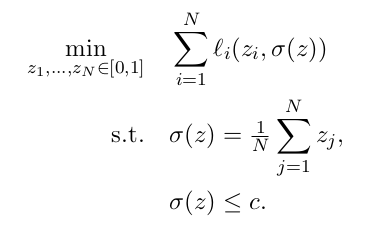

# C.I.A.O.: Constrained Intelligent Aggregative Optimization

:construction: Work In Progress! 

This repository accompanies my thesis work on **distributed coordination algorithms for constrained aggregative optimization problems**. 

## 🔎 Motivation

We study a **cloud offloading scenario**, where multiple users (e.g., robots, IoT devices, satellites) decide how much computation to execute locally vs. offload to a cloud server.
- **Local execution** → higher energy consumption, reduced battery lifetime.  
- **Cloud offloading** → possible congestion and capacity limits.  

The challenge is to **balance local and cloud execution** to minimize costs while respecting **global cloud capacity**. The goal is to add a constraint that involves the aggregation term e.g. the mean of the agents' state.

---

## 🎯 Goal

- Formalize constrained **aggregative optimization problems**, where costs depend both on individual decisions and on an **aggregate variable**.  
- Design and implement **distributed primal-dual algorithms** that allow each agent to optimize locally with limited communication.  
- Compare with **centralized solutions** for benchmarking.  

---

## ✏️ Problem Formulations

We consider several variants:

1. **Box constraints**  
   - Decision variables constrained to \([0,1]\).  
   - Centralized: Projected Gradient Descent.  
   - Distributed: Aggregative Tracking (consensus-based).  

2. **Affine constraints**  
   - Agents subject to linear coupling constraints.  
   - Centralized: Saddle-Point Dynamics / Augmented Lagrangian Primal-Dual Gradient Dynamics (Aug-PDGD) [Qu & Li, 2019].  
   - Distributed: Distributed Aggregative Primal-Dual Algorithm [Du & Meng, 2025].  

3. **Aggregate constraints**  
   - Explicit constraint on the aggregate variable \(\sigma(z)\).  
   - Centralized: Primal-Dual Gradient Method.  
   - Distributed: Primal-Dual with Consensus.  

---

## 🚀 Algorithms Implemented

- **Saddle-Point Dynamics (PDGD)**  
  - Based on Qu & Li (2019).  
  - Implemented in continuous time and discretized via Forward Euler.  

- **Discrete-Time Primal-Dual (Arrow-Hurwicz-Uzawa)**  
  - Based on Notarnicola (2024).  
  - Direct discrete-time formulation with simplified Lagrangian.  

- **Distributed Primal-Dual Algorithms**  
  - Local primal-dual updates.  
  - Consensus for tracking global aggregates.  

---

## 📚 References

- G. Qu, N. Li, *On the Exponential Stability of Primal-Dual Gradient Dynamics*, IEEE Control Systems Letters, 2019.  
- B. Notarnicola, *Semiglobal Exponential Stability of Discrete-Time Primal-Dual Algorithms for Constrained Optimization*, Automatica, 2024.  
- K. Du, M. Meng, *Distributed Aggregative Optimization with Affine Coupling Constraints*, Neural Networks, 2025.  

---

## 👥 Authors

- **Luca Fantini** (Master student)  
- **Gianluca Bianchin** (Supervisor)  
